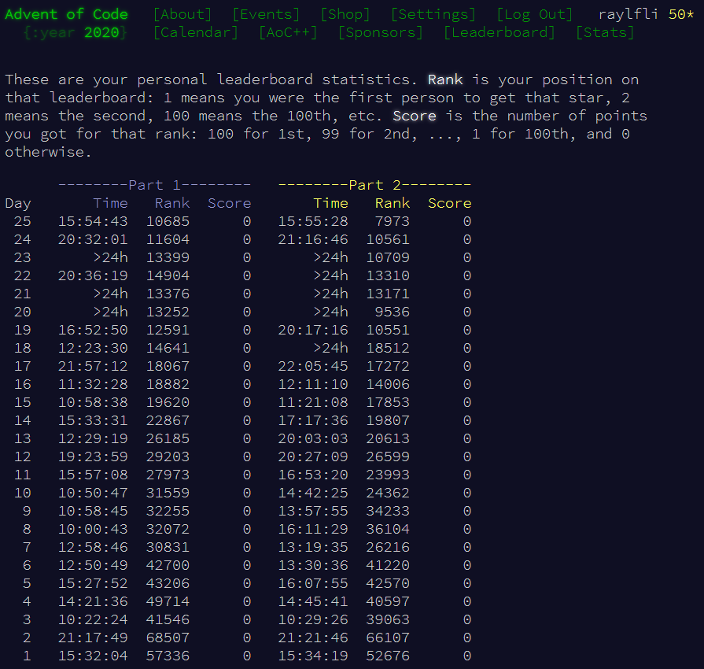

# Advent of Code 2020

> *Advent of Code* is an Advent calendar of small programming puzzles for a variety of skill sets and skill levels that can be solved in any programming language you like.
\- [Eric Wastl (Advent of Code creator)](http://was.tl/) 

This year's calendar can be found [here](https://adventofcode.com/2020).

## Information and Comments

Although I've done a few Advent of Code puzzles in the past, this was the first year I decided to commit to completing all of them!

In each directory you'll find my solution for each day as well as a shortened version of the puzzle text (with a link to the full text). While each solution isn't completely optimized, all of them run under 30 seconds on my machine.

A few of the days were quite tricky, notably Day 20, and I completed the majority of the puzzles on the day that they were released.

Most of the days were completed without looking at any solutions, but for a very small selection of them, solutions from the Advent of Code [subreddit](https://www.reddit.com/r/adventofcode/) were glanced at to inspire algorithms and efficiency.

Advent of Code was incredibly fun and educational! I've learned quite a bit about designing algorithms and programming for efficiency through the puzzles. 

Happy Holidays! :)

## Personal Statistics

